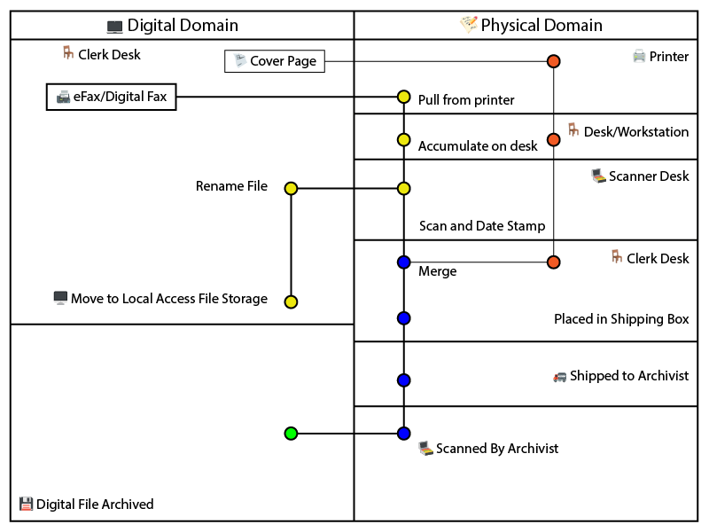

## Abstract

Office workflows often include hidden inefficiencies that are difficult to identify and address without proper documentation. This study presents a visual method for documenting processes that tracks how documents move between digital and physical work domains to identify problems and find improvements. The methodology emphasizes three core optimization principles: keeping digitally-originated files in digital format whenever possible, merging document components early in the process to establish completeness, and eliminating unnecessary steps. By mapping workflows using a simple diagram that shows these transitions, organizations can visualize redundant steps, measure process complexity, and calculate efficiency improvements. The method is demonstrated through analysis of document processing workflows in an office environment, revealing significant inefficiencies including unnecessary printing and scanning cycles, manual date stamping, and missed opportunities for automation. Process A required 14 nodes with 4 digital-physical domain crossings, while Process B achieved identical outcomes using only 6 nodes with 0 domain crossings. The approach provides both visual clarity of process flow and concrete metrics for measuring improvement, enabling data-driven decisions about workflow optimization.

## Introduction

Modern offices operate in a hybrid environment where documents exist both digitally and physically, creating complex workflows that often include unnecessary transitions between these two domains. While digital tools have eliminated many inefficiencies, many organizations still use processes designed for paper-based operations without considering the real cost of constantly switching between digital and physical formats.

Traditional process documentation focuses on step-by-step procedures without highlighting the hidden costs of format conversions. Conventional flowcharts show what happens but often fail to reveal why certain steps are wasteful or how they could be improved. This becomes particularly challenging in environments where documents serve multiple purposes - digital storage, physical handling, and archival requirements.

This study presents a visual method for process documentation that clearly tracks movement between digital and physical work domains. By creating a clear visual distinction between these two environments, the approach makes inefficiencies immediately obvious to supervisors and staff, and provides a framework for measuring process improvement.

The method uses a split diagram where digital work appears on the left side of a vertical line and physical work on the right. Document types start at the top based on their origin (digital documents like emails start on the left, physical mail starts on the right), and the process flows downward with each crossing between digital and physical domains clearly marked by vertical transitions. Horizontal lines represent movements between different physical locations or digital systems. This visualization technique reveals the true complexity of workflows and identifies improvement opportunities that might otherwise remain hidden.

## Methodology

Two eFax processing workflows were analyzed (Process A and Process B) using a standardized diagram format. The visualization method employs the following conventions:

**Diagram Structure:**
- A vertical line divides the workspace into digital domain (left side) and physical domain (right side)
- Document entry points are positioned at the top based on origin format
- Process nodes represent discrete workflow states or actions
- Vertical lines indicate transitions between digital and physical domains
- Horizontal lines demarcate different physical workstation locations or digital system boundaries

**Measurement Metrics:**
- **Nodes**: Counted as discrete process states or actions (represented as circles in the diagrams)
- **Domain Crossings**: Vertical transitions between digital and physical domains
- **Location Changes**: Horizontal movements between different workstations or systems
- **Manual Operations**: Steps requiring human intervention that could potentially be automated

**Process Documentation:**
Process A was mapped starting with eFax receipt in digital format, followed by printing to physical domain, manual date stamping at clerk workstation, scanning back to digital domain at scanner workstation, file renaming, local file storage, merging with cover letter, and final digital submission to archivist with concurrent physical document shipping.

Process B was designed starting with eFax receipt in digital format, immediate merging with digital cover page, file renaming, local file storage, and direct digital submission to archivist.

Color coding was applied to indicate document completion status: yellow/orange for incomplete documents, blue for complete documents, and green for process completion. Processing times were estimated for both individual document processing and batch processing scenarios using 150 documents as the test volume.

## Results

### Process A

**Figure 1.** Process A (eFax processing workflow) showing the complex movement between digital and physical domains (14 nodes, 4 digital-physical crossings). The color coding represents document completeness: yellow/orange indicates incomplete documents, blue represents complete documents, orange highlights manual physical operations, and green indicates final completion. The zigzag pattern illustrates the inefficiencies created by multiple domain crossings.

**Process A Efficiency Metrics**

| Metric | Value | Analysis |
|--------|-------|----------|
| Total Nodes | 14 | High complexity workflow |
| Digital-Physical Crossings | 4 | Excessive format conversions |
| Location Changes | 3 | Multiple physical handoffs |
| Manual Operations | 5 | Date stamping, cover page addition, filing, scanning, printing |
| Automation Potential | Limited | Physical steps prevent batch processing |

Process A demonstrates a complex workflow with significant inefficiencies. The process begins with a digital eFax but immediately converts to physical format for manual processing, creating a characteristic "zigzag" pattern of domain crossings. The workflow requires movement between multiple physical locations (clerk desk with printer, clerk desk with stamp, scanner desk) and involves substantial manual intervention.

### Process B

**Figure 2.** Process B (eFax processing workflow) maintaining digital format throughout the process (6 nodes, 0 digital-physical crossings). The color coding represents document completeness: yellow/orange indicates incomplete documents missing components, blue represents complete documents with all components merged, and green indicates process completion. This streamlined approach eliminates unnecessary conversions while maintaining all required outcomes.

**Process B Efficiency Metrics**

| Metric | Value | Improvement vs Process A |
|--------|-------|-------------------------|
| Total Nodes | 6 | 57% reduction |
| Digital-Physical Crossings | 0 | 100% elimination |
| Location Changes | 0 | 100% elimination |
| Manual Operations | 1 | 80% reduction |
| Automation Potential | High | Full batch processing capability |

Process B eliminates unnecessary domain crossings by maintaining digital format throughout the workflow. The streamlined process merges document components early, establishes completeness quickly, and enables significant automation opportunities.

### Time Impact Analysis

**Estimated Processing Time Comparison**

| Process Type | Time per Document | 150 Documents | Error Risk | Scalability |
|--------------|------------------|---------------|------------|-------------|
| Process A | 8-12 minutes | 20-30 hours | High | Poor |
| Process B | 30 seconds | 75 minutes | Low | Excellent |

*Note: Times are estimated based on typical office operations. Process B times reflect potential with basic automation scripting.*

Process B shows potential for 95% time reduction when processing document batches, with additional improvements possible through scripted automation.

## Discussion

### Process Efficiency Analysis

Analysis of Process A revealed significant inefficiencies in the digital fax handling workflow. The zigzag pattern created by multiple domain crossings illustrates unnecessary format conversions that create bottlenecks, error opportunities, and increased processing time. The process requires 14 distinct nodes with 4 crossings between digital and physical domains and involves movement between 3 different physical locations.

Process B achieves identical outcomes while eliminating unnecessary domain crossings and reducing complexity significantly. The workflow maintains digital format throughout, requiring only 6 nodes with 0 domain crossings and 1 location (digital workstation). This optimization enables significant efficiency gains through batch processing capabilities via automation scripting.

### Why This Visual Method Works

The clear separation between digital and physical work makes inefficiencies immediately obvious to both supervisors and staff. Despite achieving identical end results, the two processes demonstrate vastly different resource requirements and complexity levels.

**Visual Impact**: The zigzag pattern created by unnecessary crossings between digital and physical domains provides immediate visual feedback about process complexity. Anyone can quickly identify problem areas without requiring detailed technical knowledge. This visual approach proves particularly effective when presenting optimization proposals to stakeholders.

**Quantifiable Metrics**: The method enables calculation of objective efficiency measures that support data-driven decision making. The number of digital-physical crossings serves as a primary inefficiency indicator, while location changes and manual operation counts provide additional targets for improvement.

**Hidden Cost Revelation**: Every crossing between digital and physical domains represents multiple hidden costs including time for format conversion, potential for error introduction, resolution degradation, loss of automation opportunities, and increased coordination overhead. By making these crossings visually obvious, the method helps organizations understand the true cost of maintaining hybrid paper-digital workflows.

### Implementation Benefits

**Error Reduction**: Domain crossings create opportunities for errors - documents can be misfiled, pages can be separated, or digital-physical matching can fail. The visualization clearly shows where these risk points occur, enabling targeted error prevention strategies.

**Automation Identification**: Digital workflows support batch processing and automated operations that are impossible with physical documents. The method clearly indicates where automation opportunities exist and quantifies their potential impact.

**Scalability Analysis**: The difference between processing one document and processing hundreds becomes dramatically apparent when comparing workflows with many domain crossings versus digital-only alternatives. This insight proves particularly valuable for organizations handling varying document volumes.

### Economic Impact

The economic benefits of reducing digital-physical crossings extend beyond simple time savings. Organizations can achieve cost reductions in multiple areas:

**Material Cost Elimination**: Process B eliminates printing and scanning, reducing paper and ink consumption to zero for this workflow. For organizations processing thousands of documents annually, these material savings can be substantial.

**Equipment Efficiency**: Reducing printer and scanner dependency frees these resources for other activities and reduces maintenance costs. The optimization also eliminates printer bottlenecks that can affect other office operations.

**Error Cost Reduction**: Manual processes introduce errors that require correction time and effort. The automated digital workflow eliminates most error sources while providing digital audit trails.

### Practical Considerations and Limitations

**Regulatory Requirements**: Certain industries or document types may require physical signatures, original documents, or paper filing for compliance purposes. The method can still identify optimization opportunities within these constraints.

**Technology Infrastructure**: Organizations with limited digital infrastructure may not be able to implement fully optimized workflows immediately. However, the visualization can guide incremental improvements and technology investment decisions.

**Change Management**: Moving from established physical processes to digital workflows requires training and cultural adaptation. The visual method supports change management by clearly demonstrating the benefits of new approaches.

### Future Applications

The digital-physical visualization method can be applied to various process types beyond document handling:

**Multi-System Workflows**: Processes involving different software systems, departments, or external partners could be analyzed using adapted concepts, with each system boundary representing a different "domain."

**Customer Service Processes**: Workflows involving both digital communication channels and physical service delivery could benefit from this analysis to improve efficiency and customer experience.

**Supply Chain Operations**: Physical-to-digital transitions in inventory management, shipping, and receiving processes could be optimized using similar visualization techniques.

## Conclusion

The digital-physical visualization method provides a powerful tool for process documentation and efficiency measurement in modern office environments. By clearly tracking movement between digital and physical work domains, organizations can identify hidden inefficiencies and quantify improvement opportunities.

The case study demonstration revealed significant optimization potential in document processing workflows, with efficiency improvements of 57% in process nodes and 100% elimination of digital-physical crossings. The batch processing capabilities enabled by digital workflows provide even greater efficiency gains for high-volume operations, with potential time reductions of 95% for large document batches.

The method's combination of visual clarity and concrete measurement makes it particularly valuable for communicating process improvements to stakeholders and building support for optimization initiatives. By making inefficiencies visually obvious while providing objective metrics for improvement measurement, the approach supports data-driven decision making about workflow optimization.

The fundamental principle of clearly tracking transitions between different work domains provides a foundation for broader process improvement frameworks in increasingly digital organizations. This simple but powerful visualization technique can help any office identify and eliminate hidden inefficiencies in their daily workflows by following three key optimization principles: **keeping digital files digital** to avoid unnecessary format conversions, **merging document components early** to establish completeness and reduce complexity, and **eliminating unnecessary steps** wherever possible to streamline operations and reduce error opportunities.